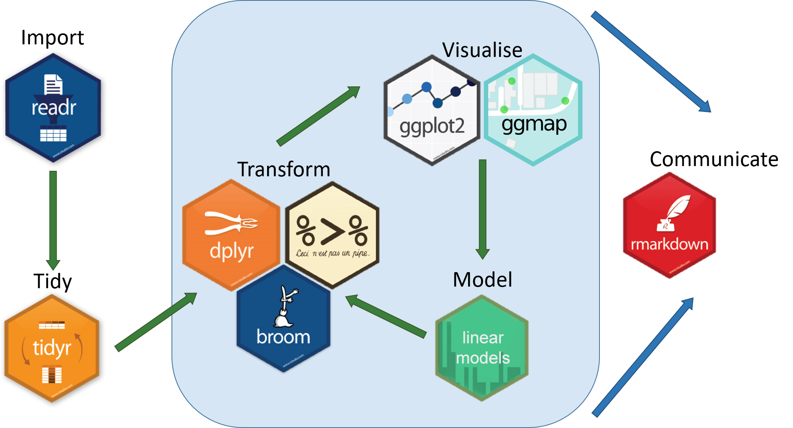

<!-- 内容相近的章节可以作为一个“部分”。为此，在一个部分的第一个章节文件的章标题
前面增加一行， 以# (PART)开头， 以{-}结尾， 中间是部分的名称 -->
# (PART) 基础篇 {-}

# 数据科学与R语言 {#DataScience-and-R}
## 数据科学 {#DataScience}
**一门科学只有当它达到了能够成功地运用数学时，才算真正发展了。**  
  
                                                              ———— 卡尔·马克思

(\#fig:unnamed-chunk-1)马克思数学手稿（1974年版）

**马克思数学手稿（Mathematical Manuscripts of Karl Marx）**是19世纪德国哲学家、经济学家、社会学家[卡尔·马克思（Karl Marx）](https://zh.wikipedia.org/wiki/%E5%8D%A1%E5%B0%94%C2%B7%E9%A9%AC%E5%85%8B%E6%80%9D)在1841年至1843年期间撰写的一些数学笔记和手稿。这些手稿在马克思生前未出版，直到1968年才首次出版,其涉及的主题包括微积分、微分方程、代数和几何学等。马克思对数学的研究主要是为了帮助他理解自然科学和经济学，他试图将数学的方法应用于社会科学，以便更好地理解社会经济现象的规律。 
  
  数学作为一门基础学科，它的思维方式和工具方法能够为各个科学领域提供重要的支持和指导，如果一门科学没有数学，那么它很可能是一个相对较为表面的科学，难以深入理解和研究，例如，物理学需要数学来描述自然现象，如牛顿力学和爱因斯坦相对论需要微积分和张量分析等数学工具;化学需要数学来解决复杂的反应和分子结构，如量子化学和化学动力学需要统计学和微分方程等数学方法;生物学需要数学来研究生物系统的行为，如生态学和生物信息学需要统计学和图论等数学手段。
  
我打小数学就不太行，高考数学更是直接拉了后腿，因此一直很佩服那些数学厉害的人，记得我的高中数学老师曾说过“数学是思维的体操”，I'll say ! （个人认为）数学思维强的人智商一般都比较高，反应能力和逻辑推理能力也都会比较强，这些人相对而言更容易在自然科学领域做出瞩目的成果，最近在看Linus的传记[@torvalds_just_2002]，他打小就是那种数学特别厉害的人，加上他对编程和操作系统疯狂的痴迷，这些因素最终让他能够开发出那个非凡的Linux操作系统！

言归正传，**什么是数据科学？**  
数据科学是一种使用统计学、计算机科学和领域知识来分析和理解数据的跨学科领域。它涉及从大量数据中提取有用信息、探索和分析数据，以便为组织和决策者提供有意义的见解。
(这个 @ChatGPT 给出的概念简单看一下就可以了，以后在实践中再慢慢体会吧.)

一句非常重要的话： **编程是工具，统计是灵魂，专业是核心**  
无论使用什么方法或工具，这些都只是解决问题的手段而已，你所要解决的问题才是你自始至终最应该关注的核心，千万不能本末倒置！

## R语言简介 {#R_intro_install}
**R的起源**  
1992年，新西兰奥克兰大学统计学教授 Ross Ihaka 和 Robert Gentleman，为了方便地给学生教授统计学课程，他们设计开发了R语言（他们名字的首字母都是R）。  
  
**R的特色**  
<!-- 列表与正文之间注意要有一个空行 -->

- R是一个统计编程语言（statistical programming）
- R可运行于多种平台之上，包括Windows、UNIX 和 Mac OS X
- R拥有顶尖水准的制图功能
- R是免费的
- R应用广泛，拥有丰富的库包
- 活跃的社区
  
**R的工作流程**  
2019 年 8 月，国际统计学年会将*考普斯总统奖*（The Committee of Presidents of Statistical Societies Awards，简称 COPSS 奖，被誉为统计学的诺贝尔奖）奖颁给 tidyverse的作者Hadley Wickham，Hadley Wickham将数据科学流程分解成6个环节：

(\#fig:tidyverse-workflow)tidyverse运行流程

<!-- 图片的引用方式是\@ref(fig:代码段的标签) -->
如图\@ref(fig:tidyverse-workflow)所示，即数据导入、数据规整、数据处理、可视化、建模以及形成可重复性报告，整个分析和探索过程都在一个程序代码中完成，这种方式对训练我们的数据思维非常有帮助。  
  
[tidyverse](https://www.tidyverse.org/)*是R语言中的一个数据科学工具包集合，由Hadley Wickham及其团队开发，旨在提供一系列易于使用且功能强大的数据分析工具。tidyverse包含了多个互相协作的包，包括了ggplot2、dplyr、tidyr、readr、purrr等等。这些包都遵循了相同的设计哲学和编程风格，以及一些共同的数据结构和函数，使得用户可以通过一致的方式来进行数据清洗、转换、可视化和建模等操作。*

**tidyverse**套餐：  

|宏包|功能|
|----|----|
|ggplot2|颜值担当|
|dplyr|数据处理王者|
|tidyr|数据转换专家|
|readr|数据载入利器|
|purrr|循环加速器|
|tibble|强化数据框|
|stringr|字符串处理|
|forcats|因子处理|
  
从下一章开始，我们将正式开始R语言的学习之旅！  

## 总结 {-}
本节的主要内容：  

- 简单介绍数据科学的概念
- 简单介绍R以及tidyverse包

