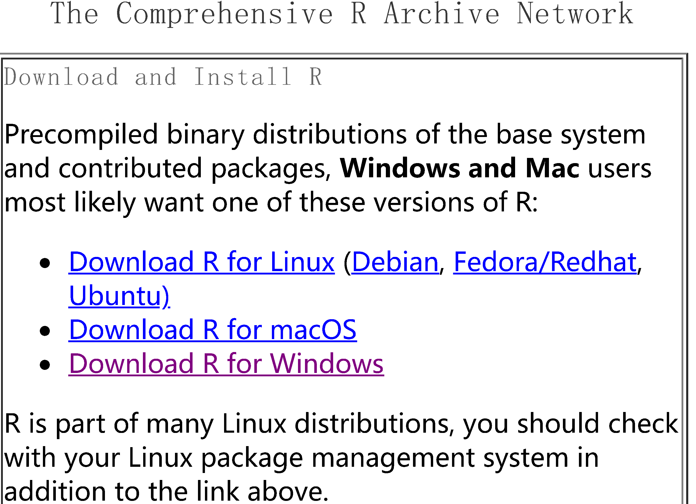
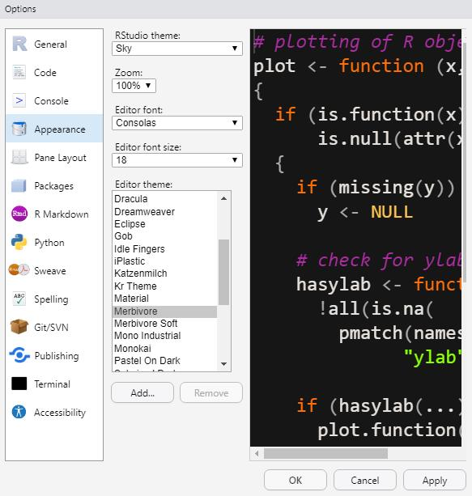
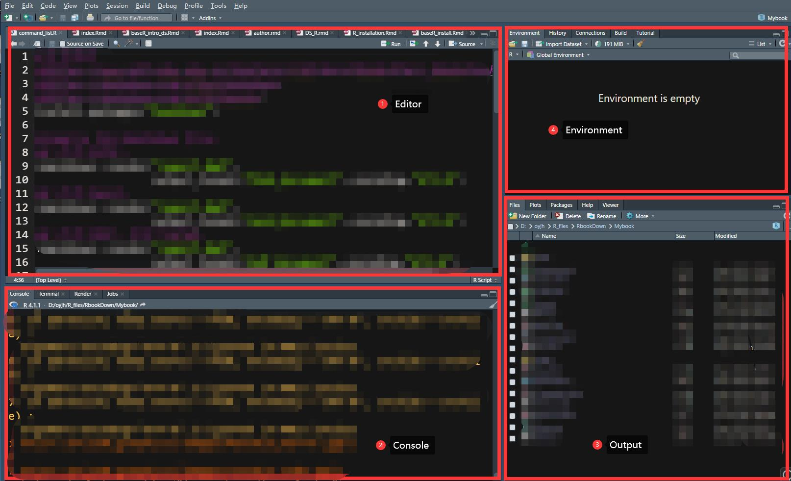

# R的安装与环境的配置 {#R-installation}

R语言是一款完全免费且开源的软件，它的开源许可证是[GNU通用公共许可证（GPL）](https://www.gnu.org/licenses/gpl-3.0.html)，这意味着任何人都可以自由地使用、复制、修改和发布R语言的源代码，甚至可以将其用于商业用途。

<div class="figure" style="text-align: center">

<p class="caption">(\#fig:unnamed-chunk-1)GPL第三版图标</p>
</div>


和python等其他语言一样，使用R语言来工作首先需要准备好R语言的**解释器**和**编辑器**。 
  
**解释器（Interpreter）***是一种程序，可以解释和执行源代码。当你运行一个使用解释器编写的程序时，解释器会逐行解释源代码，并将其转换为计算机可以理解的语言，然后立即执行,这意味着开发人员可以通过逐行调试程序，快速查找和修复错误。*  
**编辑器（Editor）***则是一种用于编写和编辑代码的程序。它提供了一种方便的方式来编辑源代码，包括高亮显示语法、自动完成和代码折叠等功能。编辑器还可以帮助开发人员在程序中添加注释、格式化代码等，从而提高代码的可读性和可维护性。*  
**集成开发环境（Integrated Development Environment，IDE）***是一种更为全面的开发工具，它包含了编辑器以外的多个工具，如调试器、编译器、版本控制等等，这些工具可以协同工作，提高开发效率。IDE通常支持多种编程语言，并提供了许多与开发相关的功能，如代码自动完成、集成式调试、图形化界面设计器等等。*  
  
R语言的解释器就是R,而R代码的编写我们推荐使用主流的IDE---RStudio,如果你熟悉python等其他语言的话，应该很容易理解R和Rstudio的关系就好比python和Pycharm的关系，不过不同的是，python的编辑器有很多，除了Pycharm外还有VS code,Eclipse,Sublime等等，而R的编辑器最主要的就是Rstudio，甚至我都没有听过R有什么其他的编辑器（也有可能是我孤陋寡闻了），原因很简单，Rstudio作为一款非常成熟和优秀的软件已经在R语言IDE中占据了主导地位！  
我们来看看它的官网介绍：  
*Used by millions of people weekly, the RStudio integrated development environment (IDE) is a set of tools built to help you be more productive with R and Python. It includes a console, syntax-highlighting editor that supports direct code execution. It also features tools for plotting, viewing history, debugging and managing your workspace.*  
  
接下来，就让我们在自己的电脑上安装R和RStudio吧！  

## 安装R {#R_interpreter}
R的安装特别简单，和在电脑上安装其他应用程序几乎没有什么区别，可以直接在官网<https://cloud.r-project.org/>上下载自己电脑配置对应的R版本：  
  

  
然后点击安装，一路默认就行。   安装完成后双击在桌面出现的R图标，出现R的控制台，在其中输入如下代码：`print("Hello world")`，换行键，如果能够出现正确的结果`Hello world`，则说明R的解释器安装成功。  
<div class="figure" style="text-align: center">

<p class="caption">(\#fig:unnamed-chunk-3)验证R是否安装成功</p>
</div>
怎么样，是不是超级简单！  
接下来我们进行R的IDE——RStudio的安装。

## 安装RStudio {#rstudio_installation}
RStudio的安装比R的安装稍微复杂一点点，不过也很简单！  
同样，先去[RStudio官网](https://posit.co/download/rstudio-desktop/)下载适合自己电脑的桌面版软件，然后执行安装程序。

<div class="figure" style="text-align: center">

<p class="caption">(\#fig:unnamed-chunk-4)下载RStudio</p>
</div>

一些其他人给出的RStudio在安装过程中的注意事项：  
<!--  这段Rmarkdown语法使用了HTML标记语言，用于添加一个带有特殊样式的“提示框”，用于强调一些重要信息或指导用户做某些事情。 -->

::: {.rmdnote}

- 电脑开机时的用户名不要用中文，否则Rstudio可能会杠上中文用户名
- 尽量安装在非系统盘，比如，可以选择安装在D盘
- 安装路径不要有中文和空格。比如，这样就比较好
   - `D:/R`
   - `D:/Rstudio`

:::
上面出现的问题并不一定会出现，但是我们能避免就尽量避免，毕竟君子不立于危墙之下嘛。

## RStudio的基本配置 {#RStudio_configuration}
安装完RStudio之后先别急着使用，我们先做一些简单的设置：  

### 更改镜像源 {#change-mirror}
RStudio默认的镜像源是国外的[CRAN](https://cran.r-project.org/mirrors.html),可能会导致下载速度慢甚至下载失败，我们可以将其改成国内镜像源，操作方法：  进入RStudio界面后，选择 Tools > Global options > packages > Change，然后选择一个离自身位置最近的镜像即可。

<div class="figure" style="text-align: center">

<p class="caption">(\#fig:unnamed-chunk-5)RStudio更改镜像源</p>
</div>
在这里，我选择了自身所在的广州的镜像作为RStudio镜像源。

### 更改字符编码 {#change-code}
为了防止出现中文乱码问题，建议提前将RStudio中的编码方式改成utf-8,选择Tools > Global options > Code，在Saving选项卡下面选择Change,再选择字符的编码方式。
<div class="figure" style="text-align: center">

<p class="caption">(\#fig:unnamed-chunk-6)RStudio更改编码方式</p>
</div>

### 更改外观 {#change-appearance}
RStudio当然具备更改编辑器外观的功能，选择Tools > Global options > Appearance

<div class="figure" style="text-align: center">

<p class="caption">(\#fig:unnamed-chunk-7)RStudio更改编码方式</p>
</div>
在这里可以选择自己喜欢的主题，字体，字体大小，编码风格等。

### 其他问题 {#other_problems}
- 如果显示我的系统不能兼容64位的RStudio，可以在<https://rstudio.com/products/rstudio/older-versions/>上找到旧的版本
- 用户名为中文名时可能会导致RStudio无法正常运行，这时建议新建一个账户用于安装RStudio
- 若RStudio长时间使用后变得卡顿，可以在Tools > Global options > General中关闭相关的自动储存选项。

## RStudio的使用 {#how-to-use-rstudio}
光说不练假把式，下面我们来简单介绍一下RStudio的基本使用（阅读本节的过程中请打开自己的RStudio对照着练习）。

### 操作界面 {#operation-panel}
打开RStudio,显示界面如下：

<div class="figure" style="text-align: center">

<p class="caption">(\#fig:rstudio-panel)RStudio操作界面</p>
</div>
如图\@ref(fig:rstudio-panel)所示，RStudio的操作界面可分为四个面板：

- 左上角是Editor窗口，用来编写代码
- 左下角是Console窗口，可以键入命令
- 右上角是Environment和History窗口，保存当前存储的数据和历史命令记录等
- 右下角是Plot和Help窗口，用于显示绘制图片和帮助文档

想要运行一段代码，直接在左下角的console输入，然后按换行键即可。

``` r
1 + 1
```

```
## [1] 2
```

### 运行脚本 {#script-run}
运行代码最好的方法是，通过Rstudio菜单栏依此点击File > New File > R Script 来创建一个新的脚本。脚本文件通常以.R作为文件的后缀名。脚本文件的好处在于我们可以在其它时间修改和重新运行它。养成用脚本写代码的习惯后，今后所有的工作都有案可查，并且具有可重复性。
<div class="figure" style="text-align: center">

<p class="caption">(\#fig:unnamed-chunk-9)RStudio创建脚本</p>
</div>
**如何运行脚本？**

1. **运行单行脚本** 将光标移至该单行，点击右上角Run键，或者在键盘上按下Ctrl+Enter键
2. **运行多行脚本** 用光标选中所要运行的脚本，点击右上角的Run键，或者在键盘上按下Ctrl+Enter键
3. **运行全部脚本**
点击右上角的Source键，或者在键盘上按下Ctrl+shift+Enter键  
  
写好的脚本可以使用Ctrl + S 保存在指定位置，下次需要使用时直接打开运行即可。

### RStudio中常用的快捷键 {#RStudio-shortcut-key}

|功能              |  按键      |
|------------------|------------|
|添加和取消代码注释|Ctrl + Shift + C|
|添加管道符号      |Ctrl + Shift + M|
|插入赋值符号      |Alt + -         |
|执行代码块        |Ctrl + Enter      |
|执行全部代码      |Ctrl + Shift + Enter|
|查看RStudio的快捷键清单|Alt + Shift + K|
|在Rmarkdown文件中插入代码段|Ctrl + Alt + I|

## 总结
本节的主要内容：  

- 安装R
- 安装RStudio
- RStudio的基本使用


